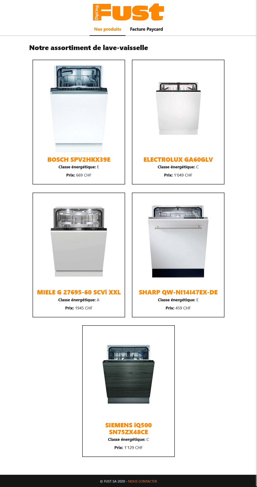
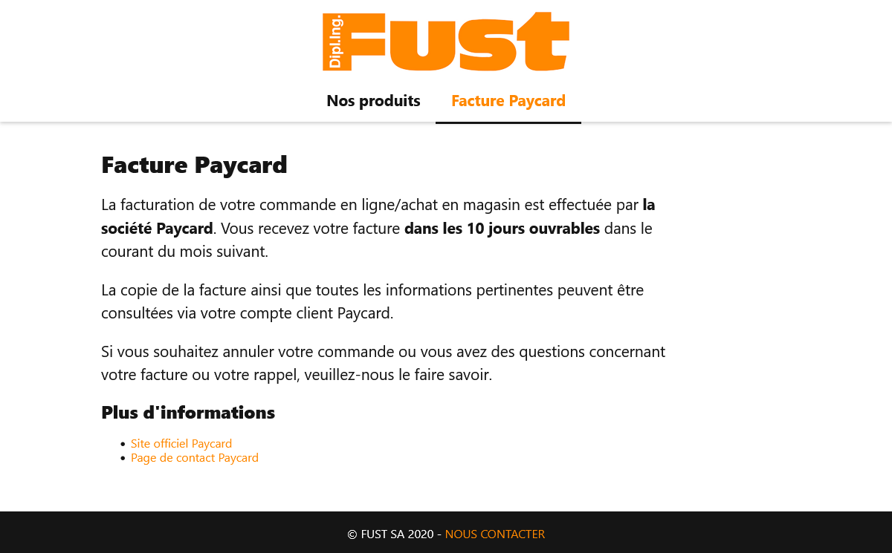

# Travail à effectuer
L'entreprise _Fust SA_ vous demande de finaliser leur microsite de vente de
lave-vaisselle.

Le site se compose de deux pages :
* `index.html` - Liste des lave-vaisselles
* `paycard.html` - Présentation du système de facturation _Paycard_

Vanellope qui a commencé le site est partie en vacances et vous a laissé
les indications ci-après pour finaliser le site.

Vous trouverez les fichiers sources (images, textes, etc.)
dans le dossier `_sources/`.

> Ne pas accéder au dossier `_sources/` depuis vos fichiers HTML !
> 
> Copiez les fichiers (images, pdf, ...) du dossier `_sources/` dans un des dossiers de votre site (img, css, ...)
> ou à la racine du projet.

### Maquettes du résultat attendu
#### index.html

---

#### paycard.html

---

## Indications de Vanellope
Hello, 

Désolé de te demander de terminer mon travail, mais je dois partir en
vacances ce soir. 

Tu peux directement modifier le code dans mes fichiers HTML & CSS.

Ci-après, mes indications pour finir le site.

### Général
* Modifier le titre (celui qui apparaît dans l'onglet du navigateur) de chaque 
  page pour qu'il soit plus pertinent. Pour l'instant, j'ai juste mis `COUCOU`.
  * `index.html` _lave-vaisselle - Fust.ch_
  * `paycard.html` _Paycard - Fust.ch_
* Au survol les liens du site doivent avoir 
  une couleur de police grise `#666666`
* Tous les paragraphes doivent avoir : 
  * une taille de police de `1.3rem`
  * une hauteur de linge de `1.5`
  * une largeur maximum de `800px`

## Entête
* Ajuster la hauteur du logo de l'entête du site pour qu'il fasse maximum `80px`

## Page des lave-vaisselles
* Ajouter les images des produits
* Afficher le nom des produits en orange `#ff8800`
* Ajouter une bordure noire `#151515` de `2px` autour des produits
* Modifier l'affichage des lave-vaisselles pour qu'ils s'affichent sur 2 
  colonnes
  * Les éléments doivent être centrés horizontalement si seul dans la ligne

## Page Paycard
Je n'ai pas eu le temps de faire le contenu principal, tu le trouveras 
dans le fichier `_sources/Paycard.docx`.

## Pied de page
Pareil, pas eu le temps d'en faire un et de l'ajouter aux deux pages.

Pour le contenu mets simplement `© Fust SA 2020 - Nous contacter`.

_Nous contacter_ est un lien qui renvoie sur l'email `contact@fust.ch`.

Pour le style : 
  * Fond noir `#151515`
  * marge extérieure en haut de `2rem`
  * marges intérieures de `20px` en haut et en bas et de `40px` à gauche et à droite
  * Couleur du texte blanc `#ffffff`
  * Textes en majuscules
  * Textes centrés horizontalement
 

Merci d'avance pour ton aide et comme dirait mon ami Ralph : 
> _"Tu vas tout casser !"_

Vanellope Von Schweetz
